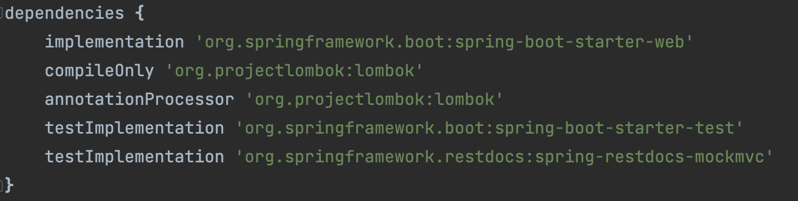
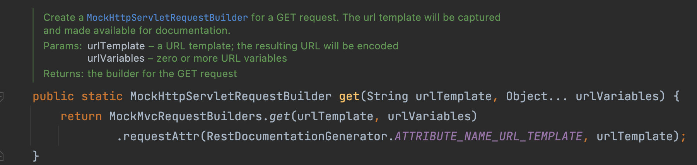
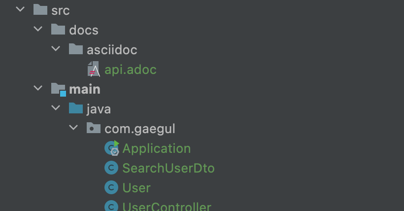
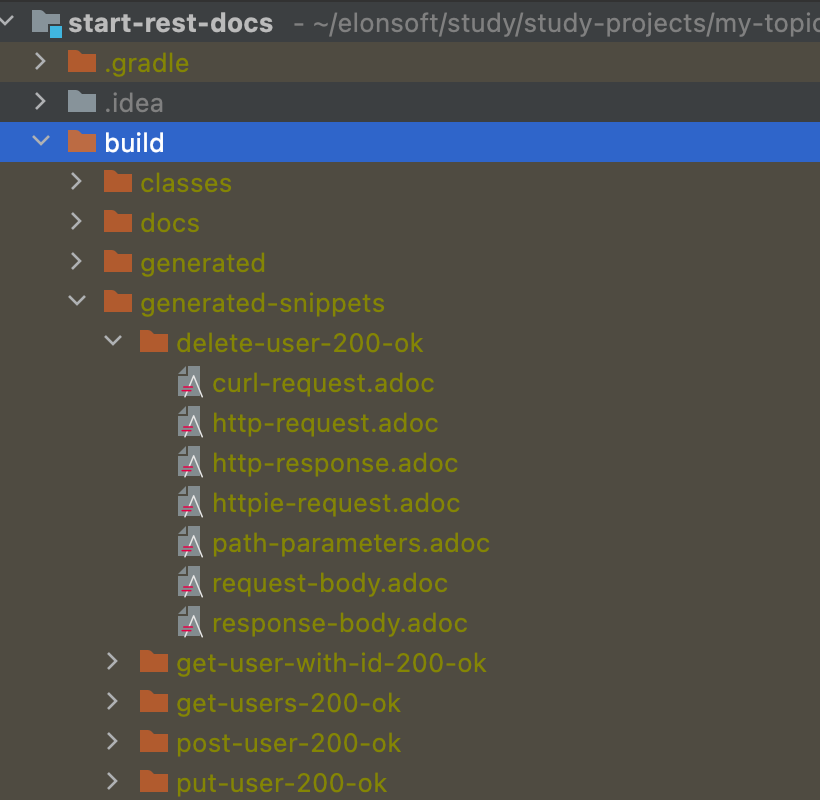
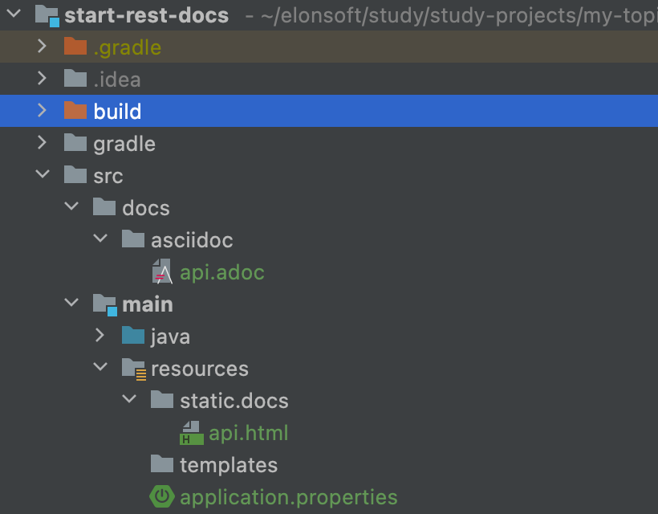
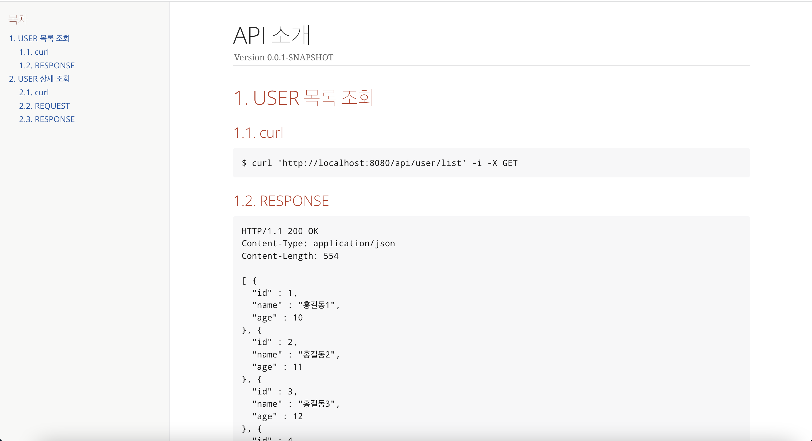

# Spring Rest Docs 알아보기


- [Spring Rest Docs 설정 및 사용](#Spring_Rest_Docs_설정_및_사용)
- [Spring Rest Docs 문서화](#Spring_Rest_Docs_문서화)
<br />
<hr />

# Spring Rest Docs 설정 및 사용

## spring-restdocs-mockmvc 의존성 추가



## Spring Rest Docs 사용

### Rest Docs 공통 유틸

```java
public interface ApiDocumentUtils {

    /**
     * API 요청 정보
     */
    static OperationRequestPreprocessor getDocumentRequest() {
        return preprocessRequest(
                modifyUris()
                        .host("localhost") // (1)
                        .port(8080), // (2)
                prettyPrint());
    }

    /**
     * API 응답 정보
     */
    static OperationResponsePreprocessor getDocumentResponse() {
        return preprocessResponse(prettyPrint());
    }
}
```

- (1) 기본 설정은 `localhost.com`, 원하는 host로 변경할 수 있다.
- (2) 기본 설정은 `8080`, 포트도 변경할 수 있다.

### 다중 데이터 조회

```java
@Test
@DisplayName("User 리스트 조회")
void getUsers() throws Exception {
    // given
    given(userService.getUsers()).willReturn(userList);

    // when

    // then
    mockMvc.perform(get("/api/users")) // (1)
            .andExpect(status().isOk())
            .andDo(print())
            .andDo(document("get-users-200-ok", // (2)
                    getDocumentRequest(), // (3)
                    getDocumentResponse(), // (3)
                    responseFields( // (4)
                            fieldWithPath("[].id").type(JsonFieldType.NUMBER).description("아이디"),
                            fieldWithPath("[].name").type(JsonFieldType.STRING).description("이름"),
                            fieldWithPath("[].age").type(JsonFieldType.NUMBER).description("나이")
                    )));
}
```

- (1) 테스트를 위해 일반적으로 `MockMvcRequestBuilders.get()`를 사용하지만 문서화를 위해 `RestDocumentationRequestBuilders.get()`을 사용한다.
    - `RestDocumentationRequestBuilders` 는 `MockMvcRequestBuilders` 를 사용하고 Rest Docs 설정을 추가해준다.

      

- (2) Rest Docs 정보를 입력한다.
    - API 관련 정보가 get-users-200-ok 폴더에 asciidoctor 파일로 생성된다.
- (3) 유틸로 정의한 정보를 사용한다.
- (4) Rest Docs에 응답 필드 정보를 설정한다.
    - 응답 필드가 배열인 경우 `fieldWithPath("[].id")`로 입력한다.
    - 만약 배열에 이름이 있다면 `fieldWithPath("users.[].id")`로 입력한다.

### 단일 데이터 조회(Query Parameter)

```java
@Test
@DisplayName("User 조회")
void getUser() throws Exception {
    // given
    Long id = 3L;
    User user = userList.stream()
            .filter(item -> item.getId().equals(id))
            .findFirst()
            .get();
    given(userService.getUser(any())).willReturn(user);

    // when
    // then
    mockMvc.perform(get("/api/user?id=", id)) // (1)
            .andExpect(status().isOk())
            .andExpect(jsonPath("$.id").value(user.getId())) // (2)
            .andExpect(jsonPath("$.name").value(user.getName())) // (2)
            .andExpect(jsonPath("$.age").value(user.getAge())) // (2)
            .andDo(print())
            .andDo(document("get-user-with-id-200-ok",
                    getDocumentRequest(),
                    getDocumentResponse(),
                    requestParameters( // (3)
                            parameterWithName("id").description("아이디")
                    ),
                    responseFields(
                            fieldWithPath("id").type(JsonFieldType.NUMBER).description("아이디"),
                            fieldWithPath("name").type(JsonFieldType.STRING).description("이름"),
                            fieldWithPath("age").type(JsonFieldType.NUMBER).description("나이")
                    )));
}
```

- (1) Endpoint URI가 Query Parameter를 가지는 경우 정보가 들어가는 필드를 입력하고 정보를 다음 매개변수로 넘긴다.
- (2) 테스트를 위해 응답 데이터를 검증한다.
- (3) Rest Docs에 Query Parameter 정보를 입력한다.

### 데이터 저장 요청

```java
@Test
@DisplayName("User 생성 OK")
void saveUser() throws Exception {
    // given
    User user = new User(11L, "홍길동11", 20);
    given(userService.saveUser(any())).willReturn(user);

    // when

    // then
    mockMvc.perform(post("/api/users")
                    .contentType(MediaType.APPLICATION_JSON_VALUE)
                    .content(objectMapper.writeValueAsString(user))) // (1)
            .andExpect(status().is2xxSuccessful())
            .andExpect(jsonPath("$.id").value(user.getId()))
            .andExpect(jsonPath("$.name").value(user.getName()))
            .andExpect(jsonPath("$.age").value(user.getAge()))
            .andDo(print())
            .andDo(document("post-user-200-ok",
                    getDocumentRequest(),
                    getDocumentResponse(),
                    requestFields( // (2)
                            fieldWithPath("id").type(JsonFieldType.NUMBER).description("아이디"),
                            fieldWithPath("name").type(JsonFieldType.STRING).description("이름"),
                            fieldWithPath("age").type(JsonFieldType.NUMBER).description("나이")
                    ),
                    responseFields(
                            fieldWithPath("id").type(JsonFieldType.NUMBER).description("아이디"),
                            fieldWithPath("name").type(JsonFieldType.STRING).description("이름"),
                            fieldWithPath("age").type(JsonFieldType.NUMBER).description("나이")
                    )));
}
```

- (1) 테스트를 위해 생성한 User 인스턴스를 Json String으로 변환하여 데이터를 전달한다.
- (2) `@RequestBody`로 데이터를 받는 Json Request 필드를 Rest Docs에 입력한다.

### 데이터 삭제(Path Parameter)

```java
@Test
@DisplayName("User 삭제 OK")
void deleteUser() throws Exception {
    // given
    Long id = 4L;

    // when

    // then
    mockMvc.perform(delete("/api/users/{id}", id)) // (1)
            .andExpect(status().isOk())
            .andDo(print())
            .andDo(document("delete-user-200-ok",
                    getDocumentRequest(),
                    getDocumentResponse(),
                    pathParameters( // (2)
                            parameterWithName("id").description("아이디")
                    )));
}
```

- (1) Endpoint URI가 Path Parameter를 가지는 경우 정보가 들어가는 필드를 입력하고 정보를 다음 매개변수로 넘긴다.
- (2) Rest Docs에 Path Parameter 정보를 입력한다.

<br />
<hr />

# Spring Rest Docs 문서화

## build.gradle 설정

<details>
<summary>전체 코드</summary>
<div markdown="1">

    ```java
    plugins {
        id 'org.springframework.boot' version '2.6.5'
        id 'io.spring.dependency-management' version '1.0.11.RELEASE'
        id 'org.asciidoctor.jvm.convert' version '3.3.2'
        id 'java'
    }
    
    group = 'com.gaegul'
    version = '0.0.1-SNAPSHOT'
    sourceCompatibility = '11'
    
    configurations {
        compileOnly {
            extendsFrom annotationProcessor
        }
    }
    
    repositories {
        mavenCentral()
    }
    
    ext {
        set('snippetsDir', file("build/generated-snippets"))
    }
    
    dependencies {
        implementation 'org.springframework.boot:spring-boot-starter-web'
        compileOnly 'org.projectlombok:lombok'
        annotationProcessor 'org.projectlombok:lombok'
        testImplementation 'org.springframework.boot:spring-boot-starter-test'
        testImplementation 'org.springframework.restdocs:spring-restdocs-mockmvc'
    }
    
    tasks.named('test') {
        outputs.dir snippetsDir
        useJUnitPlatform()
    }
    
    tasks.named('asciidoctor') {
        inputs.dir snippetsDir
        dependsOn test
    }
    
    asciidoctor.doFirst {
        delete file('src/main/resources/static/docs')
    }
    
    bootJar() {
        dependsOn asciidoctor
        copy {
            from "${asciidoctor.outputDir}"
            into 'src/main/resources/static/docs'
        }
    }
    
    task copyDocument(type: Copy) {
        dependsOn asciidoctor
        from file('build/docs/asciidoc')
        into file('src/main/resources/static/docs')
    }
    
    build {
        dependsOn copyDocument
    }
    ```
</div>
</details>

### plugins

```java
plugins {
    id 'org.springframework.boot' version '2.6.5'
    id 'io.spring.dependency-management' version '1.0.11.RELEASE'
    id 'org.asciidoctor.jvm.convert' version '3.3.2'
    id 'java'
}
```

- gradle 7이상부터는 `id 'org.asciidoctor.jvm.convert' version '3.3.2'`
  이전 버전은 `id 'org.asciidoctor.convert' version '1.5.6’`을 사용한다.

### sinppetDir 추가

```java
ext {
    set('snippetsDir', file("build/generated-snippets"))
}
```

- 빌드된 결과가 생성되는 폴더 경로 설정

### asciidoctor task

```java
tasks.named('asciidoctor') { // (1)
    inputs.dir snippetsDir
    dependsOn test
}

asciidoctor.doFirst { // (2)
    delete file('src/main/resources/static/docs')
}
```

- (1) 빌드될 때 수행하는 task 추가
- (2) asciidoctor task가 수행되기 전에 `src/main/resources/static/docs` 경로의 파일을 삭제한다.

### copyDocument task

```java
task copyDocument(type: Copy) {
    dependsOn asciidoctor
    from file('build/docs/asciidoc') // (1)
    into file('src/main/resources/static/docs') // (2)
}
```

- (1) asciidoctor task 수행하여 생성된 `build/docs/asciidoc` 경로의 파일을 프로젝트 내부 `src/main/resources/static/docs` 경로에 복사한다.

### bootJar

```java
bootJar() {
    dependsOn asciidoctor
    copy { // (1)
        from "${asciidoctor.outputDir}"
        into 'src/main/resources/static/docs'
    }
}
```

- (1) asciidoctor task 수행하여 생성된 파일을 빌드 시 생성되는 jar 파일 내부 `src/main/resources/static/docs` 경로에 복사한다.

### build

```java
build {
    dependsOn copyDocument
}
```

- 빌드시 copyDocument task를 수행한다.

## HTML API 문서 생성

- 생성된 파일을 묶어 html api문서로 만들기 위해서 gradle인 경우 `src/docs/asciidoc`
  하위에 adoc 파일을 만들어줘야한다.



### api.adoc 파일 작성

```java
// nav 위치 설정
:toc: left
// nav 타이틀명
:toc-title: 목차
// 자동 번호 매기기 설정
:sectnums:

// snippet 위치 설정
ifndef::snippets[]
:snippets: ./build/generated-snippets
endif::[]

= API 소개

== USER 목록 조회

=== curl

// snippet include
include::{snippets}/get-users-200-ok/curl-request.adoc[]

=== RESPONSE

include::{snippets}/get-users-200-ok/http-response.adoc[]

== USER 상세 조회

=== curl

include::{snippets}/get-user-with-id-200-ok/curl-request.adoc[]

=== REQUEST

include::{snippets}/get-user-with-id-200-ok/http-request.adoc[]

=== RESPONSE

include::{snippets}/get-user-with-id-200-ok/http-response.adoc[]
```

## Gradle Build

- `compileJava → test → asciidoctor → bootJar` 순서대로 실행된다.

### snippets 파일 생성

- 빌드 되면 설정했던 경로인 `buld/generated-snippets` 경로에 파일이 생성된다.

  


### HTML API 파일 생성

- `src/docs/asciidoc/api.adoc` 파일을 읽어 resources 폴더 하위에 `static/docs/api.html` 파일을 생성한다.

  

- API HTML

  